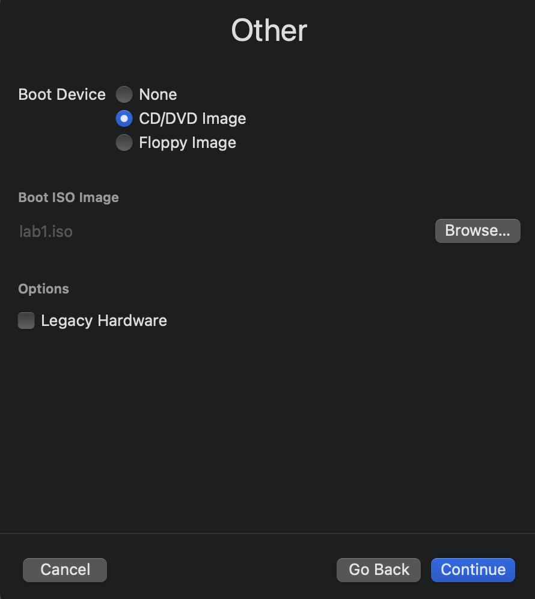
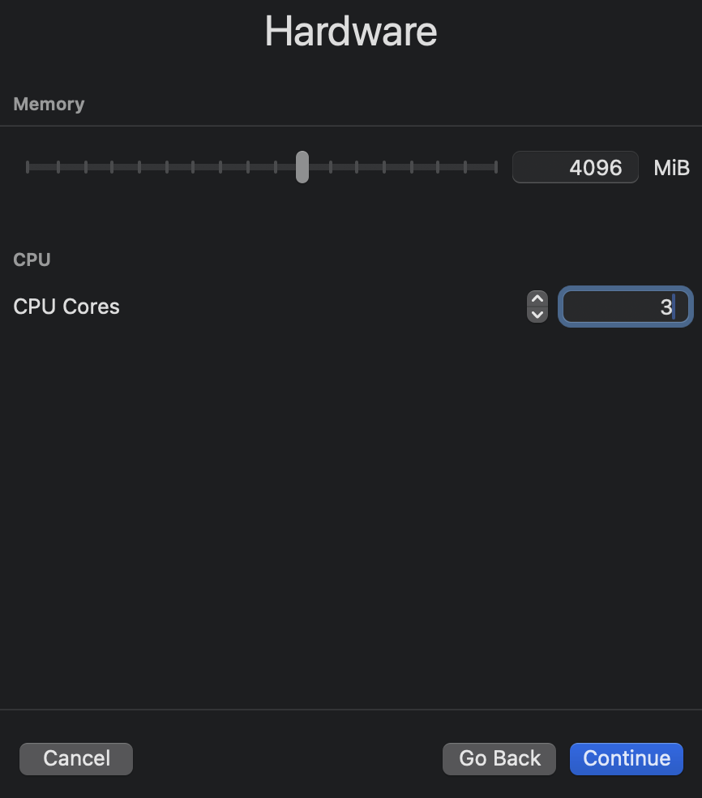
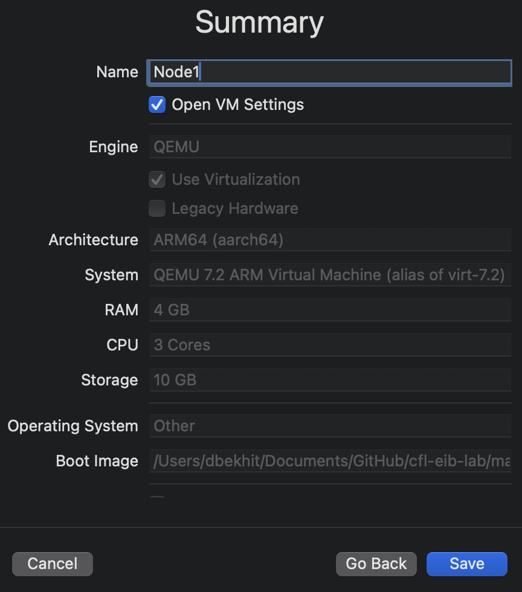
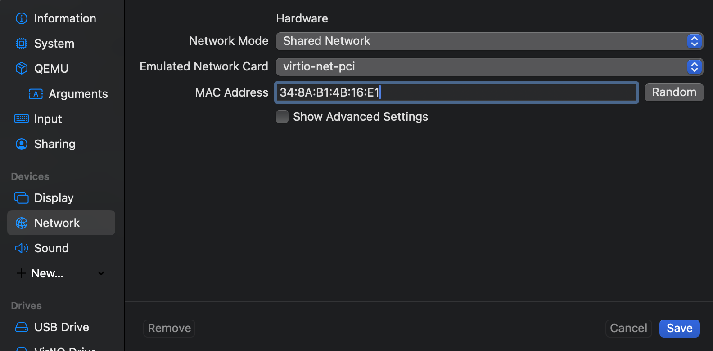

# Lab 1

### Definition file
Populate your `definition.yaml` with the following contents:
```yaml
apiVersion: 1.1
image:
  arch: aarch64
  imageType: iso
  baseImage: SL-Micro.aarch64-6.0-Default-SelfInstall-GM.install.iso
  outputImageName: lab1.iso
operatingSystem:
  users:
    - username: root
      encryptedPassword: $6$harL4dKSOzhzprzV$Kquzh7WwOSQhivefg/KVC2XRyCpxG0gOoj1c97ySOPolfRWmvtY5fTQFWrTxjuEmUKYinB7A1HAH1cf3oYjjv0
    - username: danny
      encryptedPassword: $6$harL4dKSOzhzprzV$Kquzh7WwOSQhivefg/KVC2XRyCpxG0gOoj1c97ySOPolfRWmvtY5fTQFWrTxjuEmUKYinB7A1HAH1cf3oYjjv0
kubernetes:
  version: v1.30.4+k3s1
  network:
    apiVIP: 192.168.64.11
  nodes:
    - hostname: node1.suse.com
      type: server
      initializer: true
    - hostname: node2.suse.com
      type: agent
  manifests:
    urls:
      - https://raw.githubusercontent.com/dbw7/misc/main/k8s-examples/apache-example.yaml
```
This definition file specifies that we will be building an ISO image named `lab1.iso` using `SL-Micro.aarch64-6.0-Default-SelfInstall-GM.install.iso` as a base for an `aarch64` system.

In the `operating-system` section, we provide a password to the root user which is `root`. We also create a `YOUR-NAME` user with the same password. The reason we do this is because in SL Micro 6.0, we cannot SSH in as the root user.

In the `kubernetes` section we specify that we will be using the `v1.30.4+k3s1` version. We also set the api Virtual IP for K3s to `192.168.64.11`. We tell K3s that the machine with the hostname `node1.suse.com` will be a server node and will also be the initializer node. `node2.suse.com` will be an agent node. Lastly, we will be downloading and deploying the manifest found at this url `https://raw.githubusercontent.com/dbw7/misc/main/k8s-examples/apache-example.yaml`.

### Network

`node1.suse.com.yaml` contents:
```yaml
routes:
  config:
  - destination: 0.0.0.0/0
    metric: 100
    next-hop-address: 192.168.64.1
    next-hop-interface: eth0
    table-id: 254
  - destination: 192.168.100.0/24
    metric: 100
    next-hop-address:
    next-hop-interface: eth0
    table-id: 254
dns-resolver:
  config:
    server:
    - 192.168.64.1
    - 8.8.8.8
interfaces:
- name: eth0
  type: ethernet
  state: up
  mac-address: 34:8A:B1:4B:16:E1
  ipv4:
    address:
    - ip: 192.168.64.21
      prefix-length: 24
    dhcp: false
    enabled: true
  ipv6:
    enabled: false
```

`node2.suse.com.yaml` contents:
```yaml
routes:
  config:
  - destination: 0.0.0.0/0
    metric: 100
    next-hop-address: 192.168.64.1
    next-hop-interface: eth0
    table-id: 254
  - destination: 192.168.100.0/24
    metric: 100
    next-hop-address:
    next-hop-interface: eth0
    table-id: 254
dns-resolver:
  config:
    server:
    - 192.168.64.1
    - 8.8.8.8
interfaces:
- name: eth0
  type: ethernet
  state: up
  mac-address: 34:8A:B1:4B:16:E2
  ipv4:
    address:
    - ip: 192.168.64.22
      prefix-length: 24
    dhcp: false
    enabled: true
  ipv6:
    enabled: false
```

Here we create files that will be consumed by a custom tool that utilizes [nmstate](https://nmstate.io/) to generate network configuration files. The node is identified through the mac address.

`node2.suse.com.yaml` sets the static ip `192.168.64.22` to the machine with the mac-address `34:8A:B1:4B:16:E2`.

### Kubernetes manifest file

`kubernetes/manifests/nginx.yaml` contents:
```yaml
apiVersion: v1
kind: Service
metadata:
  name: my-nginx-svc
  labels:
    app: nginx
spec:
  type: LoadBalancer
  ports:
  - port: 80
  selector:
    app: nginx
---
apiVersion: apps/v1
kind: Deployment
metadata:
  name: my-nginx
  labels:
    app: nginx
spec:
  replicas: 2
  selector:
    matchLabels:
      app: nginx
  template:
    metadata:
      labels:
        app: nginx
    spec:
      containers:
      - name: nginx
        image: nginx:1.14.2
        ports:
        - containerPort: 80
      affinity:
        podAntiAffinity:
          requiredDuringSchedulingIgnoredDuringExecution:
          - labelSelector:
              matchExpressions:
              - key: app
                operator: In
                values:
                - nginx
            topologyKey: "kubernetes.io/hostname"
```

In addition to being able to provide manifests through URLs, you can also provide local manifests. This manifest creates an nginx deployment where only 1 pod is allowed per node. This is to showcase how the 2 nodes will interact with each other.

### Building the image

After populating all of the files and directories we will now generate the final image to be deployed.

CD into the parent directory of all of the files, for example, in this lab that would be the file that is equivalent to `config1/`.

In here, run the following command:
```
podman run --rm -it --privileged -v $(pwd):/eib registry.opensuse.org/isv/suse/edge/edgeimagebuilder/containerfile-sp6/suse/edge-image-builder:1.1.0.rc2  build --definition-file  definition.yaml`
```

The output should look like:
```
Pulling selected Helm charts... 100% |█████████████████████████████████████████████████████████████████████████████| (2/2, 1 it/s)        
Generating image customization components...
Identifier ................... [SUCCESS]
Custom Files ................. [SKIPPED]
Time ......................... [SKIPPED]
Network ...................... [SUCCESS]
Groups ....................... [SKIPPED]
Users ........................ [SUCCESS]
Proxy ........................ [SKIPPED]
Rpm .......................... [SKIPPED]
Os Files ..................... [SKIPPED]
Systemd ...................... [SKIPPED]
Fips ......................... [SKIPPED]
Elemental .................... [SKIPPED]
Suma ......................... [SKIPPED]
Populating Embedded Artifact Registry... 100% |████████████████████████████████████████████████████████████████| (5/5, 4 it/min)          
Embedded Artifact Registry ... [SUCCESS]
Keymap ....................... [SUCCESS]
Configuring Kubernetes component...
Downloading file: k3s_installer.sh
WARNING: An external IP address for the Ingress Controller (Traefik) must be manually configured in multi-node clusters.
Kubernetes ................... [SUCCESS]
Certificates ................. [SKIPPED]
Cleanup ...................... [SKIPPED]
Building ISO image...
Kernel Params ................ [SKIPPED]
Build complete, the image can be found at: lab1.iso
```

We now have the built image `lab1.iso`.

### Deploying the image on UTM

For this lab, we will be deploying 2 virtual machines using the same ISO on UTM.

Begin by opening UTM and selecting `Create a New Virtual Machine`


Select `virtualize`


Select `other`


Select `CD/DVD Image` then click `browse` and select your lab 1 ISO file`.


Set at least `3GB` ram and `3` CPU Cores.


Set the storage to `10GiB`


Continue and then select `Open VM Settings` and then save. You can also set the name of the VM if you'd like.



Go to `Network` Select `Shared-Network` and set the `MAC Address` to the one found in `node1.suse.com.yaml`


Then start the VM

Create a second VM repeating all of the previous instructions but using the `Mac Address` from `node2.suse.com.yaml`.