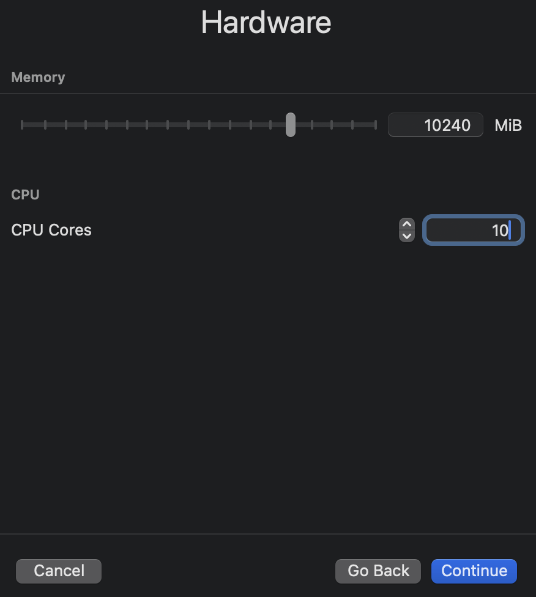

# Lab 1

### Definition file
Populate your `definition.yaml` with the following contents:
```yaml
apiVersion: 1.1
image:
  arch: aarch64
  imageType: iso
  baseImage: SL-Micro.aarch64-6.0-Default-SelfInstall-GM.install.iso
  outputImageName: lab2.iso
operatingSystem:
  users:
    - username: root
      encryptedPassword: $6$harL4dKSOzhzprzV$Kquzh7WwOSQhivefg/KVC2XRyCpxG0gOoj1c97ySOPolfRWmvtY5fTQFWrTxjuEmUKYinB7A1HAH1cf3oYjjv0
    - username: danny
      encryptedPassword: $6$harL4dKSOzhzprzV$Kquzh7WwOSQhivefg/KVC2XRyCpxG0gOoj1c97ySOPolfRWmvtY5fTQFWrTxjuEmUKYinB7A1HAH1cf3oYjjv0
kubernetes:
  version: v1.30.4+k3s1
  helm:
    charts:
      - name: ollama
        repositoryName: ollama
        version: 0.58.0
        targetNamespace: ollama
        createNamespace: true
        valuesFile: ollama-values.yaml
      - name: open-webui
        repositoryName: openwebui
        version: 3.1.9
        targetNamespace: ollama
        createNamespace: true
        valuesFile: openwebui-values.yaml
    repositories:
      - name: openwebui
        url:  https://helm.openwebui.com/
      - name: ollama
        url: https://otwld.github.io/ollama-helm/
```
This definition file specifies that we will be building an ISO image named `lab1.iso` using `SL-Micro.aarch64-6.0-Default-SelfInstall-GM.install.iso` as a base for an `aarch64` system.

In the `operating-system` section, we provide a password to the root user which is `root`. We also create a `YOUR-NAME` user with the same password. The reason we do this is because in SL Micro 6.0, we cannot SSH in as the root user.

In the `kubernetes` section we specify that we will be using the `v1.30.4+k3s1` version. We also provide the Helm repositories for ollama and for open-webui. We then specify the charts and reference the relevant repositories.

### Helm Values Files

`kubernetes/helm/values/ollama-values.yaml` contents:
```yaml
ollama:
  models:
    - tinyllama:latest
```

`kubernetes/helm/values/openwebui-values.yaml` contents:
```yaml
ollama:
  enabled: false
ollamaUrls: ['http://ollama:11434']
```

This is how to provide a values file for a specified Helm chart. It must match the name provided in the `valuesFile` field.

### Extra configuration
In the config directory, create the following file:
`custom/scripts/80-proxy.sh`

Make it executable:
`chmod +x 80-proxy.sh`

And provide the following content:
```
#!/bin/bash
set -euo pipefail

cat <<- EOF > /etc/systemd/system/kubectl-port-forward.service
[Unit]
Description=Kubectl Port Forward for OpenWeb-UI Service
Requires=k3s.service
PartOf=k3s.service
After=k3s.service
ConditionPathExists=/opt/bin/kubectl
ConditionPathExists=/etc/rancher/k3s/k3s.yaml


[Service]
Type=simple
User=root
WorkingDirectory=/root
ExecStartPre=/bin/sh -c 'until systemctl is-active --quiet k3s.service; do sleep 10; done'
ExecStart=/opt/bin/kubectl port-forward svc/open-webui 8080:80 --namespace=ollama --kubeconfig=/etc/rancher/k3s/k3s.yaml
Restart=on-failure
RestartSec=60

[Install]
WantedBy=multi-user.target
EOF

systemctl enable kubectl-port-forward.service
```

This script will be executed during combustion

### Building the image

After populating all of the files and directories we will now generate the final image to be deployed.

CD into the parent directory of all of the files, for example, in this lab that would be the file that is equivalent to `config2/`.

In here, run the following command:
```
podman run --rm -it --privileged -v $(pwd):/eib registry.opensuse.org/isv/suse/edge/edgeimagebuilder/containerfile-sp6/suse/edge-image-builder:1.1.0.rc2  build --definition-file  definition.yaml`
```

The output should look like:
```
Pulling selected Helm charts... 100% |█████████████████████████████████████████████████████████████████████████████| (2/2, 1 it/s)        
Generating image customization components...
Identifier ................... [SUCCESS]
Custom Files ................. [SKIPPED]
Time ......................... [SKIPPED]
Network ...................... [SUCCESS]
Groups ....................... [SKIPPED]
Users ........................ [SUCCESS]
Proxy ........................ [SKIPPED]
Rpm .......................... [SKIPPED]
Os Files ..................... [SKIPPED]
Systemd ...................... [SKIPPED]
Fips ......................... [SKIPPED]
Elemental .................... [SKIPPED]
Suma ......................... [SKIPPED]
Populating Embedded Artifact Registry... 100% |████████████████████████████████████████████████████████████████| (5/5, 4 it/min)          
Embedded Artifact Registry ... [SUCCESS]
Keymap ....................... [SUCCESS]
Configuring Kubernetes component...
Downloading file: k3s_installer.sh
WARNING: An external IP address for the Ingress Controller (Traefik) must be manually configured in multi-node clusters.
Kubernetes ................... [SUCCESS]
Certificates ................. [SKIPPED]
Cleanup ...................... [SKIPPED]
Building ISO image...
Kernel Params ................ [SKIPPED]
Build complete, the image can be found at: lab1.iso
```

We now have the built image `lab2.iso`.

### Deploying the image on UTM

For this lab, we will be deploying 2 virtual machines using the same ISO on UTM.

Begin by opening UTM and selecting `Create a New Virtual Machine`


Select `virtualize`


Select `other`


Select `CD/DVD Image` then click `browse` and select your lab 1 ISO file`.


Set at least `10GB` ram and `10` CPU Cores.


Set the storage to `45GiB`


Press continue and save until the end and start the VM.